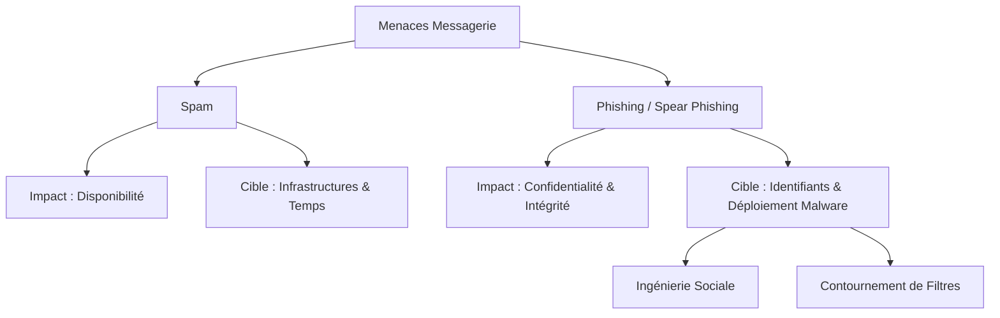
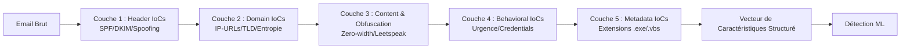
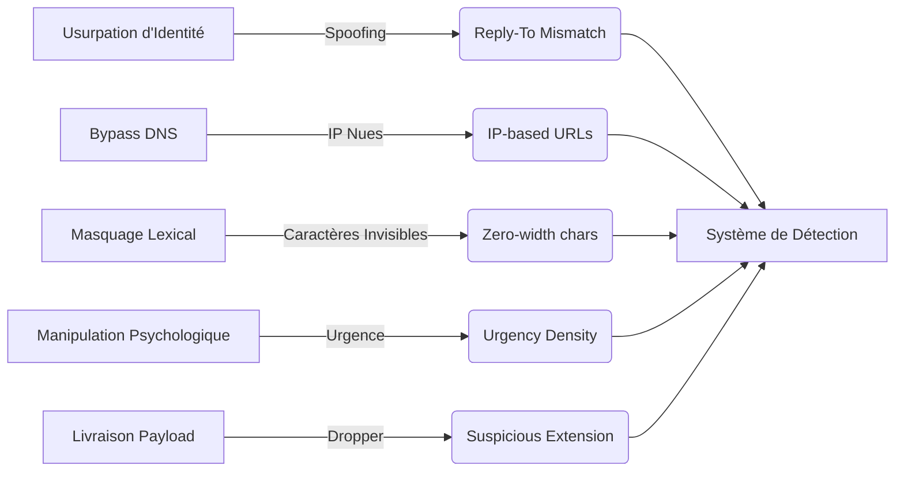

# Diagrammes d'Architecture Cybersécurité (Mermaid)

Voici les codes sources des diagrammes pour ton rapport. Tu peux les compiler sur [Mermaid Live Editor](https://mermaid.live/) et les inclure dans ton document LaTeX sous forme d'images.

### 1. Classification des Menaces (Threat Tree)

### 2. Architecture de Filtrage Multi-Couches (Pipeline)

### 3. Mapping Attaque -> IoC

